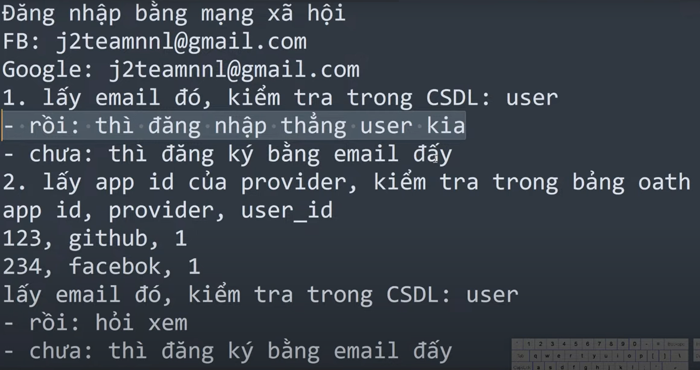

-   [laravel social](https://laravel.com/docs/8.x/socialite#main-content)
-   [social provider](https://socialiteproviders.com/about/#provider-issues)

## install

```bash
composer require laravel/socialite
```

---

## config service

-   Vào `services.php`, thêm đoạn code này

```php
'github' => [
    'client_id' => env('GITHUB_CLIENT_ID'),
    'client_secret' => env('GITHUB_CLIENT_SECRET'),
    'redirect' => env('CALLBACK_URI' . '/github'),
],
```

-   Cái env `CALLBACK_URI` để dùng chung cho việc login với các mạng xã hội khác

---

## github

-   Chúng ta phải có tài khoản github để lấy `client_id` và `client_secret`
-   Hướng dẫn tạo oauth app: [tại đây](https://docs.github.com/en/apps/oauth-apps/building-oauth-apps/creating-an-oauth-app)
-   Lưu ý 2 chỗ:
    -   Homepage URL: điền url của web mình
    -   Authorization callback URL: điền url của web mình + `/auth/callback/github` :cái này là callback trả về
-   Sau khi tạo xong thì nó sẽ trả về clientID và clientSecret, ta sẽ tạo thêm ở trong file `.env`
-   Do cái redirect mình khai báo lúc tạo oauth app nên ko cần
-   Sau đó tạo route bên `web.php`

```php
use Laravel\Socialite\Facades\Socialite;

// route này dùng chung cho các mạng xã hội khác
Route::get('/auth/redirect/{provider}', function ($provider) {
        return Socialite::driver($provider)->redirect();
    });

Route::get('/auth/callback/{provider}', function ($provider) {
          $user = Socialite::driver($provider)->user();
    })->name('socialite_callback');
```

-   Fix lỗi cUrl error 60: [tại đây](https://stackoverflow.com/questions/42094842/curl-error-60-ssl-certificate-in-laravel-5-4)
    hoặc [xem ở youtube](https://www.youtube.com/watch?v=f5jQqWvw44U)
    
-   cách 2 sẽ an toàn hơn, chúng ta sẽ lưu app id của provider (vd là facebook hay github)
-   Chúng ta sẽ viết 1 hàm `callback()` trong controller `CustomerAuth`
-   Trong hàm `callback()`: Nếu không có thì sẽ tạo mới, tuy nhiên khi tạo mới thì nó chưa có password nên phải sửa lại database cho cái password đó là `nullable`

---

## Thêm vào model `Customer`

```php
use Illuminate\Auth\Authenticatable;
use Illuminate\Contracts\Auth\Authenticatable as AuthenticatableContract;

class Customer extends Model implements AuthenticatableContract {
    use Authenticatable;
}
```

-   Thêm những cái này thì mới có thể login bằng social

---

## facebook

-   [facebook graph api]
-   Bấm vào tạo ứng dụng
-   Sau khi nhập xong thông tin thì nó sẽ trả về `App ID` và `App Secret`. Xem ở mục cài đặt ở sidebar bên trái

---

# fix lỗi đăng nhập facebook

-   Phải có https -> tạo một tên miền ảo trong xampp

1. Đầu tiên vào `C:\Windows\System32\drivers\etc` -> mở file `hosts` lên

-   chuột phải -> properties -> security -> Users -> edit -> cấp quyền full control -> apply (việc này để cho phép sửa file hosts và save được)
-   Thêm tên miền ảo vào file hosts

```txt
127.0.0.1 namecommerce.com
```

2. Vào `C:\xampp\apache\conf\extra` -> mở file `httpd-vhosts.conf` lên

```txt
<VirtualHost *:8000>
   DocumentRoot "C:/xampp/htdocs"
	ServerName namecommerce.com
</VirtualHost>
```
- Cái server name phải trùng với cái tên miền ảo ở trên
- Sau đó restart lại apache
